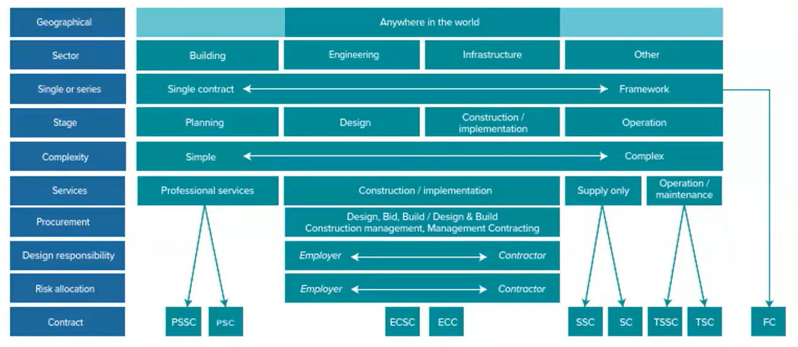
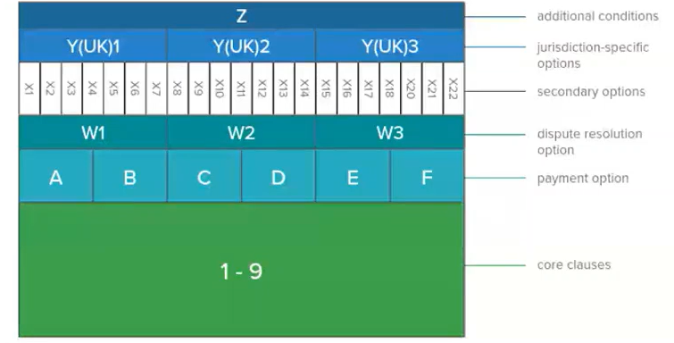
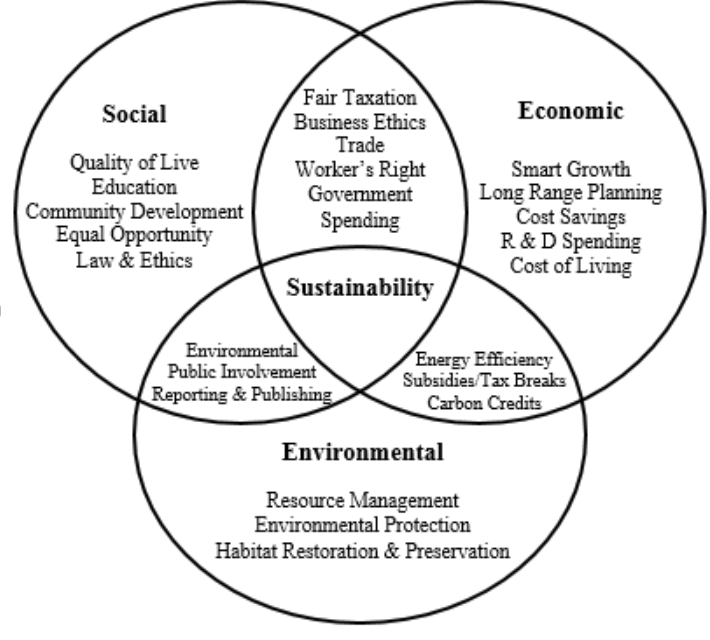
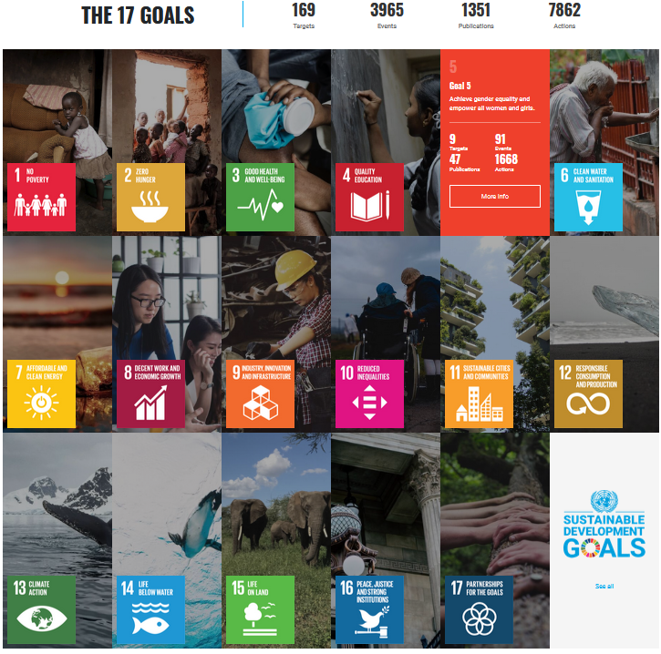
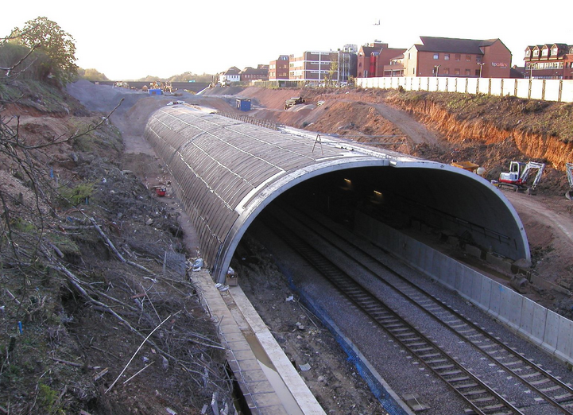

# Chartership Professional Review - Revision Notes

## Acknowledgements:

The following materials includes information, questions and materials contributed by the following:

- CEng MICE **Julia Collins**
- CEng MICE PhD **Mengxiao Li**
- CEng MICE **Bryn Noble**

Additions to the revision material also include questions I was asked during my mock interviews as well as general questions I included as part of revising various topics.

 
**NOTE** This merely meant as supplementary material, make sure to DYOR and make sure the information included below is still current and/or relevant. 
**NOTE** All notes in green throughout this document have been included to provide guidance and/or help you tailor the revision materials to your experience, please pay attention to those.

---

### ICE - Code of Conduct:

1. All members shall discharge their professional duties with **integrity** and shall behave with integrity in relation to all conduct bearing upon the standing, reputation and dignity of the Institution and of the profession of civil engineering.
2. All members shall only undertake work that they are **competent** to do.
3. All members shall have full regard for the public interest, particularly in relation to matters of **health and safety**, and in relation to the well-being of future generations.
4. All members shall show due regard for the **environment** and for the sustainable management of natural resources.
5. All members shall develop their professional knowledge, skills and competence on a continuing basis and shall give all reasonable assistance to further the education, training and **continuing professional development** of others.
6. All members shall:
- Promptly **notify** the Institution if convicted of a serious criminal offence;
- Promptly notify the Institution if they have had membership of another professional body terminated as the result of a disciplinary procedure;
- Promptly notify the Institution upon becoming bankrupt or disqualified as a Company Director;
- Promptly notify the Institution where the member, in good faith, believes there has been a significant breach of the Rules of Professional Conduct by another member;
- Promptly notify the employer or relevant authority where the member, in good faith, has a concern about a danger, risk, malpractice or wrongdoing which affects others (but this shall be an obligation only where the law of the relevant jurisdiction provides protection for such good-faith reporting under ‘whistleblowing’ or similar legislation), and;
- Support a colleague or any other person to whom the member has a duty of care who in good faith raises any issues covered by Rules 6d or 6e.

My Acronym: **ICH-ECN** – **I**ntegrity, **C**ompetent, **H&S**, **E**nvironment, **C**ontinuous Professional Development, **N**otification.
> \> inspired by the famous speech by JFK "Ich bin ein Berliner" - also the name of one of my favorite sour beers :)

**NOTE** You should be able to list the points above, explain what any of them mean to you and potentially give an example where you utilized one of them.

---

## Codes and Standards:

**NOTE** Specific codes and standards that were relevant to my work, adjust to suit your experience.

**Design Codes**

| **Code**       | **Title**                                                         | **Description and Relevance**                                                                                                                                 |
| -------------- | ----------------------------------------------------------------- | ------------------------------------------------------------------------------------------------------------------------------------------------------------- |
| **BS EN 1990** | **Eurocode: Basis of Structural Design**                          | Provides the principles and requirements for the safety, serviceability, and durability of structures. It serves as the foundation for all Eurocodes.         |
| **BS EN 1991** | **Eurocode 1: Actions on Structures**                             | Specifies the actions (loads) that need to be considered when designing structures, such as dead loads, live loads, wind, snow, and seismic actions.          |
| **BS EN 1992** | **Eurocode 2: Design of Concrete Structures**                     | Covers the design of concrete structures, including buildings, bridges, and tunnels, with rules for reinforced and prestressed concrete.                      |
| **BS EN 1993** | **Eurocode 3: Design of Steel Structures**                        | Provides guidelines for the design of steel structures, including rules for buildings, bridges, and other steel constructions.                                |
| **BS EN 1994** | **Eurocode 4: Design of Composite Steel and Concrete Structures** | Combines rules for designing composite structures made of steel and concrete, which are commonly used in buildings and bridges.                               |
| **BS EN 1995** | **Eurocode 5: Design of Timber Structures**                       | Covers the design of timber structures, with guidance on joints, structural elements, and overall stability.                                                  |
| **BS EN 1996** | **Eurocode 6: Design of Masonry Structures**                      | Provides rules for the design of masonry structures, including both reinforced and unreinforced masonry used in buildings and other structures.               |
| **BS EN 1997** | **Eurocode 7: Geotechnical Design**                               | Focuses on geotechnical design, including the analysis of soil properties, foundation design, and the construction of earth-retaining structures and tunnels. |
| **BS EN 1998** | **Eurocode 8: Design of Structures for Earthquake Resistance**    | Provides guidelines for designing structures to withstand seismic activity, including buildings, bridges, and infrastructure in earthquake-prone areas.       |
| **BS EN 1999** | **Eurocode 9: Design of Aluminium Structures**                    | Covers the design of aluminium structures, providing rules for buildings, bridges, and other constructions made from aluminium.                               |

**Concrete Repair**

| **Code**          | **Title**                                                         | **Description and Relevance**                                                                                                                                             |
| ----------------- | ----------------------------------------------------------------- | ------------------------------------------------------------------------------------------------------------------------------------------------------------------------- |
| **BS EN 1504-1**  | **Definitions**                                                   | Provides definitions and descriptions of terms related to the protection and repair of concrete structures.                                                               |
| **BS EN 1504-2**  | **Surface protection systems for concrete**                       | Specifies requirements for surface protection systems, including hydrophobic impregnations, coatings, and surface treatments.                                             |
| **BS EN 1504-3**  | **Structural and non-structural repair**                          | Outlines requirements for products used in the repair of concrete structures, focusing on structural and non-structural repair materials.                                 |
| **BS EN 1504-4**  | **Structural bonding**                                            | Covers products used for bonding structural elements, such as adhesives for concrete or steel bonding.                                                                    |
| **BS EN 1504-5**  | **Concrete injection**                                            | Specifies requirements for products and systems used for injecting cracks, voids, and interstices in concrete to restore its structural integrity and/or water tightness. |
| **BS EN 1504-6**  | **Anchoring of reinforcing steel bar**                            | Defines the requirements for products used to anchor reinforcing steel in concrete structures.                                                                            |
| **BS EN 1504-7**  | **Reinforcement corrosion protection**                            | Outlines requirements for products used to protect steel reinforcement against corrosion.                                                                                 |
| **BS EN 1504-8**  | **Quality control and evaluation of conformity**                  | Specifies the criteria for quality control and conformity assessment for products and systems covered by BS EN 1504.                                                      |
| **BS EN 1504-9**  | **General principles for the use of products and systems**        | Describes the general principles for selecting and using products and systems for the protection and repair of concrete structures.                                       |
| **BS EN 1504-10** | **Site application of products and systems, and quality control** | Provides guidelines for the application of products and systems on-site, including quality control procedures during application.                                         |

**Miscellaneous**

| **Code**        | **Title**                                                                              | **Description and Relevance**                                                                                                                                                                                                                                           |
| --------------- | -------------------------------------------------------------------------------------- | ----------------------------------------------------------------------------------------------------------------------------------------------------------------------------------------------------------------------------------------------------------------------- |
| **BS EN 206**   | **Concrete - Specification, performance, production, and conformity**                  | Defines the specifications and performance criteria for concrete. It covers the production process, quality control, and the conformity assessment required to ensure concrete meets the necessary standards for various construction applications.                     |
| **BS 8666**     | **Scheduling, dimensioning, bending, and cutting of steel reinforcement for concrete** | Specifies the requirements for scheduling, dimensioning, bending, and cutting of steel reinforcement for concrete. It provides guidelines for the standard shapes, sizes, and detailing of reinforcement, ensuring consistency and accuracy in reinforcement schedules. |
| **BS EN 13501** | **Fire classification of construction products and building elements**                 | Specifies the classification of construction products and building elements based on their reaction to fire. It includes tests for fire resistance, smoke production, and burning droplets, providing a framework for ensuring fire safety in buildings.                |
| **BS EN 12350** | **Testing fresh concrete**                                                             | This standard provides a series of test methods for evaluating the properties of fresh concrete, such as workability, slump, and consistency. These tests are critical for ensuring that concrete meets the desired performance criteria before it hardens.             |

**CIRIA Guidance**

| **Code**       | **Title**                                                            | **Description and Relevance**                                                                                                                                                                                                        |
| -------------- | -------------------------------------------------------------------- | ------------------------------------------------------------------------------------------------------------------------------------------------------------------------------------------------------------------------------------ |
| **CIRIA C660** | **Monitoring the Durability of Reinforced Concrete**                 | Provides guidance on techniques and methodologies for assessing the durability of reinforced concrete structures, focusing on long-term performance.                                                                                 |
| **CIRIA C670** | **Buried Structures: The Design and Construction of Foundations**    | Offers best practice guidelines for the design and construction of foundations for buried structures, including those made from reinforced concrete. It covers aspects such as load-bearing capacity and soil-structure interaction. |
| **CIRIA C671** | **Control of Ground Movements Induced by Tunnelling**                | Details best practices for managing ground movements during tunnelling, with considerations for reinforced concrete linings and their interaction with the surrounding soil.                                                         |
| **CIRIA C743** | **Good Practice for the Repair of Concrete Structures**              | Outlines methods and best practices for repairing concrete structures, focusing on ensuring durability and structural integrity during and after repair processes.                                                                   |
| **CIRIA C744** | **Good Practice for the Use of Concrete in Tunnels**                 | Covers best practices for the use of concrete in tunnel construction, addressing aspects like mix design, durability, and performance in tunnel environments.                                                                        |
| **CIRIA C753** | **Groundwater Control - Design and Practice**                        | Provides guidance on managing groundwater during construction activities, including its impact on reinforced concrete structures and methods to mitigate potential issues.                                                           |
| **CIRIA C766** | **Control of Cracking Caused by Restrained Deformation in Concrete** | Focuses on understanding and controlling cracking in concrete due to restrained deformation. It provides methods for preventing and managing cracking to maintain structural integrity and durability                                |

**Health, Safety and Welfare**

| **Code**                            | **Title**                                                                 | **Description and Relevance**                                                                                                                                                                       |
| ----------------------------------- | ------------------------------------------------------------------------- | --------------------------------------------------------------------------------------------------------------------------------------------------------------------------------------------------- |
| **CDM 2015**                        | **Construction (Design and Management) Regulations 2015**                 | Establishes responsibilities for managing health and safety in all aspects of construction, including tunnelling and confined spaces. It ensures effective planning, coordination, and supervision. |
| **HSG 47**                          | **Avoiding Danger from Underground Services**                             | Provides guidance on avoiding risks associated with underground services during excavation and tunnelling, including safe digging practices and locating utilities.                                 |
| **HSG 64**                          | **The Safe Use of Lifting Equipment**                                     | Includes guidance on the safe use of lifting equipment which is crucial for handling materials and machinery in tunnelling operations.                                                              |
| **HSG 70**                          | **Work in Confined Spaces**                                               | Offers detailed guidance on safety practices for working in confined spaces, including risk assessment, emergency procedures, and necessary training.                                               |
| **HSG 258**                         | **Managing Health and Safety in Tunnelling**                              | Provides specific guidelines for managing health and safety in tunnelling projects, including risk assessments, health hazards, and safety management.                                              |
| **HSG 262**                         | **Health and Safety in Tunnelling – Good Practice Guide**                 | Supplementary guidance to HSG 258, offering practical advice and examples of good practice for managing health and safety risks in tunnelling.                                                      |
| **HSG 279**                         | **Health and Safety in Excavations**                                      | Covers safety measures for excavation work, including those related to tunnelling, to prevent collapses and ensure safe working conditions.                                                         |
| **HSE Confined Spaces Regulations** | **Confined Spaces Regulations 1997**                                      | Requires risk assessments and safe working procedures for confined spaces, including entry procedures, atmospheric testing, and emergency planning.                                                 |
| **HSG 33**                          | **Health and Safety in Construction**                                     | Provides guidance on managing health and safety risks in the construction industry, including best practices for risk assessment, management, and compliance.                                       |
| **HSG 60**                          | **The Safe Use of Lifting Equipment**                                     | Offers guidelines for the safe use and maintenance of lifting equipment on construction sites, ensuring that equipment is used correctly and safely.                                                |
| **HSG 139**                         | **The Safe Use of Cranes**                                                | Provides guidance on the safe use of cranes on construction sites, including planning, operation, and maintenance to prevent accidents and ensure safety.                                           |
| **HSE RIDDOR**                      | **Reporting of Injuries, Diseases and Dangerous Occurrences Regulations** | Outlines the legal requirements for reporting and recording work-related injuries, diseases, and dangerous occurrences to ensure effective monitoring and prevention.                               |

---

## Construction, Design and Management (2015) Regulations:

**Key Roles**

- **Client:** Responsible for overall project safety, including appointing key roles and ensuring integration of health and safety from the start.
- **Principal Designer:** Manages safety during the design phase and coordinates with other parties to address risks in the design.
- **Principal Contractor:** Manages safety on site during construction, ensures coordination among contractors, and maintains the construction phase plan.
- **Designer:** Incorporates safety considerations into design and provides necessary information to manage risks.
- **Contractor:** Ensures their work is safely planned and managed, cooperating with others and following safety procedures.
- **Workers:** Adhere to safety instructions and cooperate with health and safety measures.

| **Role**                 | **Responsibilities**                                                                                                                                                                                                                                                                                                                                                                                                                                                                                                                                                                                                                                                                                                                                                                                                                                                                                                                                                                                                                                                                                                                                                                                                                                                                                                                                                                                                                                                                                     |
| ------------------------ | -------------------------------------------------------------------------------------------------------------------------------------------------------------------------------------------------------------------------------------------------------------------------------------------------------------------------------------------------------------------------------------------------------------------------------------------------------------------------------------------------------------------------------------------------------------------------------------------------------------------------------------------------------------------------------------------------------------------------------------------------------------------------------------------------------------------------------------------------------------------------------------------------------------------------------------------------------------------------------------------------------------------------------------------------------------------------------------------------------------------------------------------------------------------------------------------------------------------------------------------------------------------------------------------------------------------------------------------------------------------------------------------------------------------------------------------------------------------------------------------------------- |
| **Client**               | make suitable arrangements for managing their project, enabling those carrying it out to manage health and safety risks in a proportionate way. These arrangements include:  + appointing the contractors and designers to the project (including the principal designer and principal contractor on projects involving more than one contractor) while making sure they have the skills, knowledge, experience and organisational capability + allowing sufficient time and resources for each stage of the project + making sure that any principal designer and principal contractor appointed carry out their duties in managing the project. + making sure suitable welfare facilities are provided for the duration of the construction work. + maintain and review the management arrangements for the duration of the project. + provide pre-construction information to every designer and contractor either bidding for the work or already appointed to the project. + ensure that the principal contractor or contractor (for single contractor projects) prepares a **construction phase plan** before that phase begins. + ensure that the principal designer prepares a **health and safety file** for the project and that it is revised as necessary and made available to anyone who needs it for subsequent work at the site.                                                           |
| **Principal Designer**   | + plan, manage, monitor and coordinate health and safety in the pre-construction phase. In doing so they must take account of relevant information (such as an existing **health and safety file**) that might affect design work carried out both before and after the construction phase has started. + help and advise the client in bringing together **pre-construction information**, and provide the information designers and contractors need to carry out their duties. + work with any other designers on the project to **eliminate** foreseeable health and safety risks to anyone affected by the work and, where that is not possible, take steps to **reduce or control** those risks. + ensure that everyone involved in the pre-construction phase communicates and cooperates, coordinating their work wherever required. + liaise with the principal contractor, keeping them informed of any risks that need to be controlled during the construction phase.|
| **Principal Contractor** | + plan, manage, monitor and coordinate the entire construction phase. + take account of the health and safety risks to everyone affected by the work (including members of the public), in planning and managing the measures needed to control them. + liaise with the client and principal designer for the duration of the project to ensure that all risks are effectively managed. + prepare a written **construction phase plan** before the construction phase begins, implement, and then regularly review and revise it to make sure it remains fit for purpose. + have ongoing arrangements in place for managing health and safety throughout the construction phase. + consult and engage with workers about their health, safety and welfare. + ensure suitable **welfare facilities** are provided from the start and maintained throughout the construction phase. + check that anyone they appoint has the skills, knowledge, experience and, where relevant, the organisational capability to carry out their work safely and without risk to health. + ensure all workers have **site-specific inductions**, and any further information and training they need. + take steps to prevent **unauthorised access** to the site. + liaise with the principal designer to share any information relevant to the planning, management, monitoring and coordination of the pre-construction phase. |
| **Designer**             | + make sure the client is aware of the client duties under CDM 2015 before starting any design work. + when preparing or modifying designs: ---> take account of any pre-construction information provided by the client (and principal designer, if one is involved). ---> eliminate foreseeable health and safety risks to anyone affected by the project (if possible). ---> take steps to reduce or control any risks that cannot be eliminated. + provide design information to: ---> the principal designer (if involved), for inclusion in the **pre-construction information** and the **health and safety file**. ---> the client and principal contractor (or the contractor for single contractor projects) to help them comply with their duties, such as ensuring a **construction phase plan** is prepared. + communicate, cooperate and coordinate with: ---> any other designers (including the principal designer) so that all designs are compatible and ensure health and safety, both during the project and beyond. ---> all contractors (including the principal contractor), to take account of their knowledge and experience of building designs. |
| **Contractor**           | + make sure the client is aware of the client duties under CDM 2015 before any work starts. + plan, manage and monitor all work carried out by themselves and their workers, taking into account the risks to anyone who might be affected by it (including members of the public) and the measures needed to protect them. + check that all workers they employ or appoint have the skills, knowledge, training and experience to carry out the work, or are in the process of obtaining them. + make sure that all workers under their control have a suitable, site-specific induction, unless this has already been provided by the principal contractor. + provide appropriate supervision, information and instructions to workers under their control. + ensure they do not start work on site unless reasonable steps have been taken to prevent unauthorised access. + ensure suitable welfare facilities are provided from the start for workers under their control, and maintain them throughout the work. + in addition to the above responsibilities, contractors working on **projects involving more than one contractor** must: ---> coordinate their work with the work of others in the project team. ---> comply with directions given by the principal designer or principal contractor. ---> comply with parts of the construction phase plan relevant to their work |

**CDM Structure in the contract**

**NOTE** The section below was specific to my project and you should be able to explain the mechanism in which CDM was applied on your project, if the project is large enough it will have a CDM Management Plan, refer to that.

The CDM process is facilitated through the adoption of **Design Development Reviews (DDRs)**, **Interdisciplinary Design Reviews (IDRs)**, and  **L3 certificates**:
- **Design Development Reviews (DDRs):** 
Regular High-level technical walkthrough of one or more specific design areas, allowing the designer to provide progressive assurance to and revive feedback from the principal contactor; presented from all relevant Technical Discipline Leads.CDM advisors to be engaged in these reviews to advise on high and medium risks and ensure all relevant information is transferred to drawings.
- **Interdisciplinary Design Reviews (IDRs)**: 
Interdisciplinary Design Reviews ensure that a "buildable" design, fit for operation and maintenance, is developed and residual risks are communicated with a record of associated assumptions. The IDR process provides a formal focussed assessment of all geographic and systemwide design works. The IDR should be seen as the end of the design process.
- **L3 Certificates**: 
Evidence that the design is accepted and that the design can now progress to construction.

---

## NEC 4 Contracts

**NOTE** If your contract is not NEC you should only skim this section and create similar notes for your contract suite (ICC, JCT, FIDIC, Bespoke etc..). 
**NOTE** If your contract is an NEC contract you need to know the general information below as well as the specific to your contract (covered later on).

NEC: New Engineering Contract Suite.

NEC started in 1991, with the fourth iteration released in 2017, created to enhance collaboration on projects.

The NEC contracts are not limited to 'engineering' and can be used for provision of a wide array of professional services.

Types of NEC4 contracts:
- **Projects**: Engineering and Construction Contract (ECC), Engineering and Construction Short Contract (ECSC), Engineering and Construction Subcontracts (ECS), Engineering and Construction Short Subcontracts (ECSS)
- **Services**: Professional Services Contract (PSC), Professional Services Short Contract (PSSC), Professional Services Subcontract (PSS) (new), Term Service Contract (TSC), Term Service Short Contract (TSSC)
- **Supply**: Supply Contract (SC), Supply Short Contract (SSC)
- Other: Framework Contract (FC), Design, Build and Operate Contract (DBOC) (new), Alliance Contract (AC), Dispute Resolution Services Contract (replaces the adjudicators contract in NEC3).

**NOTE** 'Short contracts' are used for low risk / low complexity uses.

### Key Principles of NEC:
- **Clarity**: 
Written in plain English and contain very little legal terminology. Set out in a highly organised and modular structure. Clear roles for involved parties and processes, setting out what is needed by who and by when.

- **Flexibility**: 
 

- **Stimulus to good management**: 
--> Collaborative mindset (clauses 10.1 and 10.2). 
--> Communication between contract parties (especially earlier communication). 
--> Contract administration roles and responsibilities (PM and Supervisor). 
--> Accepted programme: heart of the NEC contract. 
--> Timescale for every action: no 'reasonable time' provision as in other contracts. 
--> Early Warning and collaborative risk management: proactive rather than reactive. 
--> Compensation Event Management (clause 60.1): based on a 'sort it out now' approach when it comes to reimbursements. 

### NEC Clauses:
 
**NOTE** diagram slightly outdated.

9 **Core Clauses** (common to all payment options):
1. General (clauses 10 to 19): all identified terms, communication and early warning process.
2. The Contractors Main Responsibilities (clauses 20 to 29)
3. Time (clauses 30 to 36): covers key dates, start and completion date, access to works, acceleration etc…
4. Quality Management (clauses 40 to 46): testing and defects
5. Payment (clauses 50 to 53): how amount due to contractor is assessed
6. Compensation events (clauses 60 to 66): covers CE processes, details 21 different types of CE, notification, assessment and implementation of CE.
7. Title (clauses 70 to 74): client's entitlement to plant and materials.
8. Liabilities and Insurances (clauses 80 to 86)
9. Termination (clauses 90 to 93): procedure and details of termination.

7 **Payment Option CLauses** (*more on this later*):
1. Option A – Priced contract with activity schedule
2. Option B – Priced contract with bill of quantities
3. Option C – Target contract with activity schedule
4. Option D – Target contract with bill of quantities
5. Option E – Cost reimbursable contract
6. Option F – Management contract
7. Option G - Term Contract

22 **Secondary Option Clauses**:
1. X1: Price adjustment for inflation (only used with options A, B, C and D)
2. X2: Changes in the law
3. X3: Multiple currencies (only used with options A and B)
4. X4: Parent company guarantee 
5. X5: Section completion
6. X6: Bonus for early completion
7. X7: Delay damages
8. X8: Undertakings to the client of others
9. X9: Transfer of rights
10. X10: Information modelling
11. X11: Termination by the client
12. X12: Multiparty collaboration
13. X13: Performance bond
14. X14: Advanced payment to contractor
15. X15: The contractor's design (extends limitation of contractor's liability for design to reasonable skill and care)
16. X16: Retention (not used with option F)
17. X17: Low performance damages
18. X18: Limitation of liability
19. X19: not used in ECC
20. X20: Key performance indicators (not used with X12)
21. X21: Whole life cost
22. X22: Early contractor involvement (used only with options C and E)

**Jurisdiction Specific Clauses**:
1. Y(UK)1: Project Bank Account (everybody gets paid at the same time)
2. Y(UK)2: The Housing Grants, Construction and Regeneration Act (most common one)
3. Y(UK)3: The Contracts (Rights of Third Parties) Act 1999

**Dispute Resolution Clauses**:
1. W1: Adjudication and The Housing Grants, Construction and Regeneration Act does not apply
2. W2: Adjudication and The Housing Grants, Construction and Regeneration Act does apply (most common one)
3. W3: Dispute avoidance board and The Housing Grants, Construction and Regeneration Act does not apply

**Z Clauses**:
Additional clauses used to amend the 9 core clauses.
 
 

### The 7 Payment Option Clauses ($$$):

First of all some useful definitions:
- Activity Schedule: a list of activities (prepared by the contractor), which they expect to carry out while providing the works. Each activity is linked to a price (prepared by the contractor) to be paid by the client.
- Priced contract: Price for works to be carried out as stated within the contract documents.
- Bill of Quantities (BoQ): a document that lists specific measured items of work identified by the drawings and specifications. Each item will be allocated a price.

#### Option A: Priced contract with activity schedule
This option contains a priced lump sum contract. The lump sum contract is then linked to a contract programme with an activity schedule. Each activity on the schedule is then allocated a price.
Each interim payment is then made upon the completion of;
1. Each group of completed activities (without defect)
2. Each completed activity not within a group.

Often used upon appointment of a contractor to carry out infrastructure, highways, buildings, and process plants, and can be used regardless of the level of design responsibility.

**Pros**:
1. Simplified payment process: it’s easier to measure when an activity is completed rather than the output of work completed on an option with a BoQ.
2. For clients: greater cost certainty then with a Target Cost option.

**Cons**:
1. For contractors: there is no provision for part payment, if there is an issue with completing an activity, no payment is made until the activity is completed.
 
 

#### Option B: Priced contract with bill of quantities
This option contains a priced contract which is linked to a Bill of Quantities (BoQ). The BoQ will contain project-specific measurements which are derived from the drawings and specifications. Each measurement will then be linked to a rate.

For example, let’s say a contractor won a bid for some work under NEC Option B. Within the tender would be a priced contract with a BoQ. Within the BoQ, there is an item for installing a new fence around the boundary of a garden.

The rate will contain the labour, plant, material and subcontractor cost required to supply and install the boundary fence. Interim payment will be assessed based on the quantity of work carried out for each individual item. 

For example, at the point of application for payment, the contractor may have supplied and installed 10 meters of fence. The contractor will then be paid for that 10 meters based on the £50 per square meter rate.

**Pros**:
1. If there is any error of measurement in the BoQ, then both parties will know how much extra is to be paid and received.
2. Greater flexibility for all parties in terms of cash flow.

**Cons**:
1. For items which contain multiple elements of work built into a singular rate, it can be difficult to assess the % of work complete.
 
 

#### Option C: Target contract with an activity schedule
This option includes a target contract linked to an activity schedule. The target contract contains a price commonly referred to as a target cost.

Under Option C, the interim payment process is as follows;
1. The contractor submits an application for payment to the client’s representative (often the Project Manager) on a monthly basis.
2. The application will contain a breakdown of the contractors’ cumulative “defined cost” plus fee minus any “disallowed cost”. This combined is known as the **“Price for Work Done to Date” (PWDD)**.
3. The application is then reviewed by the client to ensure all cost is allowable under NEC
4. The agreed cumulative cost is then deducted from the amount previously paid under the contract. This amount is then paid to the contractor.

As the works progress the target cost may be adjusted to reflect any agreed Compensation Event.

Once the works are completed, the final **Defined Cost** plus fee and the **Target Cost** are compared. The difference between the two is then shared between the contractor and client. This is known as the  "pain/gain” mechanism  and the method of how the split is calculated will vary from project to project.

For example, let’s say there is an agreement that both pain and gain is split 50/50. The contractor finished work and the final PWDD is £800k. This, in comparison to the target cost of £1mil, means the project is £200k in gain. Due to the 50/50 “pain/gain” arrangement, the contractor will receive an extra £100k on top of their final PWDD. The final account will be issued to the contractor for £900k. Alternatively, assuming the same target cost in the previous example, the final PWDD could have been £1.2 million, resulting in a £200k pain. In this scenario and assuming the same 50/50 split arrangement is in place, the contractor’s final account will be their PWDD minus £100k (£1.1 mil).

**Pros**:
1. This arrangement forces both parties to work more collaboratively as the financial success is shared by both client and contractor. Similarly, the financial failure of a project is shared. This collaborative working can reduce disputes and accelerate innovation.

**Cons**:
1. Some share ranges can sometimes be disproportionately unfavourable to contractors. Care should be taken to ensure you are not being put at financial risk.
 
 

#### Option D: Target contract with Bill of Quantities
This contract contains a target cost contract which is linked to a Bill of Quantities.

Like Option C, financial loss and financial gain are shared by both Contractor and Client. However, unlike Option C, this Option utilizes a **Bill of Quantities** to make up the price of works.

This option is sometimes used on framework agreements, where an agreed Schedule of Rates is in place and used to build multiple **Target Costs** throughout the framework agreement.

It should be noted that unlike Option B, this is not a re-measure contract. So, any error in measurement which won’t amend the price and could cause a financial loss.
 
 

#### Option E: Cost reimbursable contract
This option is a **cost-reimbursable** option. Works are paid on an open book basis. Under this option, the contractor is paid all of their incurred **Defined Cost** and an agreed overhead and profit percentage.

The client often takes on huge financial risk with this option.

Although this contract is often referred to as **“Cost Plus”**, contractors should not get complacent and think Option E means a blank chequebook for works. The terms within the contract should set out clearly what is and isn’t to be reimbursed to the contractor.

**Pros**:
1. Works that require immediate attention and cannot be defined at the project outset may benefit from a fast contract agreement.

**Cons**:
1. Less cost certainty for the client.
2. Inability for both parties to accurately plan cash flow.
 
 

#### Option F: Management contract
This option is a **cost-reimbursable** option. Unlike Option E, this option is tailored towards the management contractor procurement route.

The works are constructed by multiple subcontractors who are directly employed by a management contractor. The management contractor will be responsible for the procurement, coordination, and implementation of works in exchange for a fee. This means the client often takes on the financial risk.

**Pros**:
1. Beneficial for developers who are just entering the market as responsibility for procuring and managing the works is with the management contractor.

**Cons**:
1. Nearly all financial risk lies with the client.
 
 

#### Options G: Term Contract (use with PSC)
This option can either be Cost Reimbursable or pre-agreed Lump Sum. This Option is used for the appointment of consultants, paid on a time basis or pre-agreed cost.

Consultants employed under this option often include: Architects, Quantity Surveyors and Engineers.

Similar to an activity schedule, this option uses a priced task schedule which will list out the different rates for different consultants depending on skill and experience.

**Pros**:
1. Provides flexibility to employ a single person consultant or consultancy firm.

**Cons**:
1. Possible confusion of who holds liability for negative eventualities.
 
 

### Key Considerations of using NEC:
1. Need for quality documents.
2. Adequacy of staff resources for better project management as the contracts often require significant hands-on management.
3. Compatibility with organisational procedures.
4. Training for staff improvement and cultural change.
5. Need for project contract management systems: standard templates and common approach. (software e.g. CEMAR).

### Early Warning Notices(EWN) & Compensation Events (CE):
Early warning notices and compensation events are key mechanisms in NEC contracts, designed to facilitate proactive management of risks and changes during a project. Here’s how they work:

#### Early Warning Notices
The early warning mechanism in NEC contracts is a proactive risk management tool that aims to identify and mitigate potential problems before they affect the project.
- Triggering an Early Warning Notice:
Either party (the Employer or the Contractor) can issue an early warning notice when they become aware of an event or situation that could: 
--> Increase the cost. 
--> Delay the completion date. 
--> Impact the performance of the works.
- This notice must be given as soon as the party becomes aware of the potential issue.
- **Early Warning / Risk Reduction Meeting**: 
After an early warning notice is issued, an early warning meeting is usually held within a short period (often two weeks). The meeting is attended by the key project stakeholders, including the Project Manager, Contractor, and possibly others, depending on the situation. The goal is to discuss the potential risk, explore solutions, and agree on actions to mitigate or avoid the risk.
- **Risk Register**: 
The identified risks are recorded in a Risk Register, which is a live document updated throughout the project. The Risk Register helps track risks and the agreed-upon actions to manage them.
- Benefits: 
--> Encourages collaboration and transparency. 
--> Helps in addressing issues before they become significant problems. 
--> Aids in controlling project costs and timelines.

#### Compensation Events
Compensation events in NEC contracts are a way to manage changes and unforeseen events that impact the project, particularly in terms of time and cost.
- What is a Compensation Event? 
A compensation event is an event defined in the contract that, if it occurs, entitles the Contractor to additional time or payment. Examples include:
The Employer instructs a change to the scope of work.
Delays caused by the Employer or third parties.
Unforeseen physical conditions (like discovering unexpected ground conditions).
The list of compensation events is typically specified in the contract (e.g., NEC3 or NEC4).
- Notification of a Compensation Event: 
When a compensation event occurs, the Contractor must notify the Project Manager within a specified time (often eight weeks from when the Contractor becomes aware of the event). If the Contractor fails to notify within this period, they might lose their right to claim additional time or money.
- Assessment of the Compensation Event: 
After notification, the Project Manager assesses the impact of the event on the project’s cost and schedule.
The Contractor may be asked to provide a quotation that includes:
The additional costs incurred.
The time required to deal with the event.
Any effects on other activities in the project.
The Project Manager then reviews and either accepts, amends, or rejects the quotation.
- Implementation: 
Once agreed upon, the effects of the compensation event (adjustments to time and cost) are incorporated into the contract through a formal process. This adjustment ensures that the contract’s timeline and budget reflect the actual circumstances of the project.
Benefits: 
--> Provides a clear, structured process for dealing with changes. 
--> Helps maintain project continuity by quickly addressing the financial and time implications of unforeseen events. 
--> Reduces disputes by clearly defining the process for compensation.

#### Summary:
Early Warning Notices focus on identifying and managing potential risks proactively. Compensation Events handle changes or unforeseen events that affect the project’s cost and schedule. Both mechanisms encourage collaboration, transparency, and effective risk management, which are central to the NEC contract philosophy.

---

## ICE Presidents & Themes: 
Current at time of publishing: Prof. Jim Hall (160th ICE president). 
Previous ICE president: Anusha Shah (159th ICE president)

**NOTE** Make sure you research the current and previous ICE presidents (if the next ICE president is announced, also know about them). **NOTE** Ensure you are aware of the current president's address and goals/themes, and relate them to your work. **NOTE** More information is available in the questions section later on.

---

## Sustainability

### The three pillars of sustainability

**NOTE** The three pillars of sustainability are crucial and form the heart of any question you may get asked about sustainability, be sure to address all three pillars in your answers (unless specifically asked about one of them).

### United Nations Sustainability Development Goals (UNSDGs)
**NOTE** Identify UNSDGs relevant to your project (highlighted below for mine), and be able to explain how they apply. A different angle to this would be if you are questioned about your contribution to the UNSDGs, you should be able to name a few and explain how your experience aligns with them.

The 17 goals:
1. **No Poverty**: End poverty in all its forms everywhere, ensuring basic needs like food, clothing, and shelter are met for everyone.
2. **Zero Hunger**: Achieve food security, improve nutrition, and promote sustainable agriculture to end hunger.
3. **Good Health and Well-being**: Ensure healthy lives and promote well-being for all ages by improving healthcare and reducing disease.
4. **Quality Education**: Provide inclusive and equitable education, ensuring everyone has access to quality learning opportunities.
5. **Gender Equality**: Achieve gender equality by empowering women and girls and ensuring equal opportunities and rights.
6. **Clean Water and Sanitation**: Ensure availability and sustainable management of water and sanitation for all.
7. **Affordable and Clean Energy**: Ensure access to affordable, reliable, sustainable, and modern energy for everyone.
8. **Decent Work and Economic Growth**: Promote sustained, inclusive, and sustainable economic growth, with full and productive employment.
9. **Industry, Innovation, and Infrastructure**: Build resilient infrastructure, promote inclusive and sustainable industrialization, and foster innovation.
10. **Reduced Inequality**: Reduce income inequality within and among countries, ensuring everyone has the chance to succeed.
11. **Sustainable Cities and Communities**: Make cities inclusive, safe, resilient, and sustainable for all residents.
12. **Responsible Consumption and Production**: Ensure sustainable consumption and production patterns, minimizing waste and resource use.
13. **Climate Action**: Take urgent action to combat climate change and its impacts by reducing greenhouse gas emissions.
14. **Life Below Water**: Conserve and sustainably use the oceans, seas, and marine resources for sustainable development.
15. **Life on Land**: Protect, restore, and promote sustainable use of terrestrial ecosystems, manage forests, combat desertification, and halt biodiversity loss.
16. **Peace, Justice, and Strong Institutions**: Promote peaceful and inclusive societies, ensure access to justice for all, and build effective, accountable institutions.
17. **Partnerships for the Goals**: Strengthen the means of implementation and revitalize global partnerships for sustainable development, fostering cooperation between countries, organizations, and individuals.

---

## Questions
**NOTE** This section includes a bank of questions that I received from others, was asked in my mock interviews and the actual interview. The answers are given as a guide and you should be used them as a general benchmark against your answers. Always relate back to your own experiences.

### General Questions
**Note** This section included some questions that do not easily fit in any of the other attributes.

1. How did BIM help in the project? 
As an engineer I work alongside the BIM/CAD team, some benefits I have seen from BIM include:
- More efficient system for drawings and detail production
- Helps with clash detection and highlighting potential construction issues
- The availability of ‘federated’ model complete with meta data for materials used, which can highlight associated hazards and risks.  
A disadvantage is there’s a higher initial cost in terms of time and money to setup.

2. Do you think **(your project)** is good value for money? 
I believe the original charter for **my project**, *(details omitted for confidentiality)* would have been great value for money. However, with significant cuts to the project and recent cost inflation, I am not sure anymore.   
When first joining the team, I tried to research what the estimated price *{details omitted for confidentiality)* would be and couldn’t find any information, and I am concerned that on the current course it would not represent good value for the average citizen.

3. What are the risks of relying on/adopting automation? 
Automation should be treated as a tool, like any other design tools we’ve ever utilised, bad input means bad output. The risk with automation is people using tools without fully understanding when and how to use them, in the long run this may even lead to dependency / loss of skill in the workforce.
An engineer should always ensure they are undertaking their work **competently** and conduct their own checks, and if any gaps are identified, seek training to improve.

### Technical Questions
**NOTE** This section may not be wholly relevant, populate with question that you think up or are asked in your mock interviews.

1. What is a fundamental principle of structural engineering? 
Newton’s laws of motion 
The elasticity of a material is the amount stress induced per unit of strain; from this we can take into account geometrical properties of an object and find axial stiffness and flexural stiffness.

2. How did the design come to pass? why choose a cast in-situ invert?  
The original design process considered a twin box tunnel against the twin arches. The twin arches proved more efficient and therefore sustainable with regards to use of materials (less concrete and steel). Pre-casting of the main elements would ensure higher quality control due to manufacturing of PCC units in factory settings, as well as an accelerated construction program involving delivering units to site and then placement.

3. Are you aware of previous cut and cover tunnel failures and what have you learnt? 
The Gerard Cross Tunnel (Tesco tunnel) collapse in 2005 is a prime example of a similar structure which failed, thankfully without and casualties. The tunnels design was very similar utilising precast units to construct a single wide arch structure with a dry contact joint in the centre. The failure was due to a few factors, namely widening of the arch for future proofing without rechecking the construction sequence; this meant that the structure had become more sensitive to out of balance force, requiring more backfill at the bases and up the haunches of the arch relative to the backfill at the crown. This in combination with poor communication of deflections from the instrumentation and monitoring on site, meant that the issue was not dealt with in time. 
I have learnt that effective communication and a collaborative relationship between all parties on a project is crucial for a successful project. I also learnt the importance of considering the effects of design changes on the various aspects of a project, including temporary works and construction sequence.

4. How do you control placement on site? 
Wall corner locations are marked on the temporary blinding as measure from the setting-out-point at that specific chainage. 
A unit is delivered to site from the storage facility, operatives attach ropes to the unit, an **exclusion zone** is stablished, then a crane operator (with the help of signaller) lifts the unit off the truck,  a turntable is used to turn the units into a suitable placement position (walls are delivered horizontally and need to be turned to a vertical position without loading the loop bars). 2-3 operatives use the ropes from a safe distance to minutely adjust the position of the unit before it is placed down.

5. Was there a test ring build? 
The placement of the first ring was used a test.

6. How did you decide on modelling thermal spalling in the first minutes? 
The decision to model the explosive/thermal spalling within the first few minutes of the fire load application was based on thermal analysis conducted seeing how quickly the temperature rises in the concrete, this highlighted that at a very early stage the top 20mm reach such high temperatures that the concrete can be considered fully deteriorated, I compared this to quoted spalling times in scientific/journal articles. I discussed this with the technical director, and they approved. The values were also validated against the physical test conducted which ended up performing better than expected, likely due to the presence of PP fibres in the mix, which was not included in the analysis.

7. How do Polypropylene Fibres (PP) work? 
Polypropylene fibres are commonly used to prevent explosive spalling in fires but can also be used for early age crack control (~1 kg/m³). In a fire, the heat causes surface water to migrate into the section creating a saturated zone in the concrete, as this saturated zone heats up and the water boils, the pressure builds up causing explosive spalling; polypropylene fibres melt to create channels to alleviate this pressure thereby preventing the spalling.

8. Did the account for tolerance in the original design? 
Yes, the main tolerances included PCC dimensions measured and assessed at the factory, placement tolerances on site namely unit verticality, lipping at the joints, and stepping between rings.

9. Why did you use advanced analysis for the fire case when there already are simpler established approaches? 
I initially followed the initial established approaches of adopting a reduced section model in the analysis and conducting verifications using reduced partial safety factors, however this analysis highlighted various zones of over-utilisation.  
Another reason was I wasn’t sure how the joint would react in the case of a fire, I knew the load transfer through the joint would increase and that it would try to rotate outwards but did not have a way to quantify those effects other that advanced analysis.

10. How did you know your modelling was correct? 
I worked closely with the geotechnical team at the initial stages of developing the model to calibrate against a PLAXIS model. PLAXIS is a software package  for geotechnical analysis and design an has better soil-structure interaction capabilities. 
I calibrated the structural model against output from the PLAXIS model, focussing on the lining displacement, joint rotation, and force going through the joints. 
I also conducted hand calculations to ensure the output was reasonable, such as checking the total vertical reactions in the model under self-weight is equivalent to the total weight of the structure.
To account for the inaccuracies of FEM, I conduced mesh sensitivity analysis.
The models were also checked by a colleague following internal quality assurance policies. 

11. Why did you use higher partial safety factors in the analysis? 
I maintained the conventional partial safety factors in my verifications of the results from the advanced analysis because: 
- I was adopting novel advanced analysis, i.e. not a conventional tried-and-tested method
- The lining behaviour was sensitive to rotations in the joint, so I wanted a higher factor of safety when it came to verifying under an extreme case such as a fire.
- This gave me room within standards to manoeuvre, should the verifications highlight any issues.

12. What do you think is a negative impact of the new design? 
Some negative impacts of the new design are:
- Novel so requires specific expertise in construction; Matiere have experience with a very similar structure in France.
- More sensitive to backfilling out-of-tolerance, so requires more on-site monitoring and controls; there is a robust approach designed as part of the detailed design to address all risks identified during backfilling. (I&M monitoring convergence and joint rotation, daily shift review group to authorise backfilling operations for the day).

### Management & Leadership Questions
1. What is the IMS? 
The IMS is the **Integrated Management System**; it is a tool which combines all the business's management systems and processes into one convenient framework; enabling the business to function as one complete entity.

2. Why do we have the IMS? 
These systems help in many ways including:
- Integral part of the business for ensuring compliance to various standards such **ISO 9001 (Quality Management)**, **ISO 14001 (Environmental Management)**, **ISO 45001 (Occupational health & Safety)** and **ISO 27001 (Information Security Management)**.
- Help maintain consistency across the business.
- Acts as a benchmark/reference point to measure performance and efficiency

3. What is outlined in your company's IMS? 
The IMS covers:
- project procedures and key documentation including project management plan, project check forms, handover checklist, project risk register and time schedule.
- Document identification methods
- Project filings
- Health and safety and environment procedures and forms

4. What goes into the project management plan? 
Scope, customer success criteria, ATR, document number, deadlines, communication lines, HSE Issues

5. What is your personal management style? 
I adopt a flexible and adaptable management style based on the team I have; I adapt it after understanding the skills and competencies of my team. I trust my team members and will begin with a hand off approach delegating work and monitor progress, if I see a need to be more participative, I will organise more regular catchups to ensure members have the support they require but ultimately, I want them to learn and push themselves.

6. In a situation where they were not so reliable, if you are presented with an engineer that is not performing then what would your approach be? How would you help them? 
Firstly, I would have a friendly chat to understand the source of the issue, if its personal, and check their wellbeing, if there is anything myself / their dedicated line manager / or HR can assist with. 
If there are no issues, I would make sure they fully understand the scope of their tasks, and create an action plan for them to improve, with more regular meetings to ensure their learning and progress and give them space to ask questions. 
If the underperformance continues, I would involve their line manager in a more formal discussion regarding their performance. I would make sure to consult the company's employee handbook for procedures.

7. If they are still not performing after all these strategies, what would you do? 
I would consult HR but I imagine some form of verbal warning followed with a written warning.

8. If you were not proactive with intervening what would the consequences be? 
Poor project performance which would inevitably impact other team members, and potentially lead to poor quality output or missing deadlines which would reflect poorly on me as a manager.

9. How do you manage a project ensuring quality? 
The company should be **ISO 9001** accredited which means they would internal quality management processes in place, while the forms and process may be different their aim will be the same, ensuring high consistent quality output and improving performance. So I would familiarise myself with the company's processes and guidelines and make sure I abide by them. 
This includes the full project lifecycle, from: 
--> clearly defined roles and understanding of scope 
--> to a well laid out project management plan and agreed deliverables and project schedule 
--> Utilising quality management process such as organised documentation management, maintaining meeting minutes and a design decision log, keeping an up to date risk register and ensuring quality assurance checks are undertaken in a timely and competent manner.

10. What are some other management systems? 
- ISO 9001 Quality Management
- ISO 45001 Occupational Health & Safety
- ISO 14001 Environmental Management
- ISO 27001 Information Security Management

11. What sort of things do you do to motivate and encourage your project team? 
- Positive feedback on work
- Keeping them posted on project updates and milestones achieved (wider context of project)
- Provide opportunities for development 
- Delegating responsibility not just tasks so they take ownership of their work

12. Explain the difference between a leader and a manager? 
**Management** is the ability to plan, monitor and control a group of individuals to achieve a specific objective, making sure operations are performed as expected. 
**Leadership** is the ability to communicate, motivate, enable and inspire others to actively contribute to the success of a common objective. 
Leadership requires vision which drives change, as opposed to management which utilises organisational skills to achieve a specific goal.

13. How do you assess competency? 
I understand the required skills and attributes for the job and assess the candidate's abilities against those. Technical competencies are easier to measure using technical questions to show understanding, while soft skills can be more difficult and require more experience to ascertain. 

14. Your customer informs you that they want an additional scope of services – approximately 15 % extra scope – and preferably within the original timeframe. At the same time your manager removes one important resource from your project and can only replace them with a relatively unexperienced employee. How do you handle this situation? You have a meeting with your manager later in the day. 
Firstly, I would raise the risk of losing an experience team member to the project, considering the additional services requested, to see if they can be retained. If they cannot be retained, I would organise a handover period to ensure sufficient project knowledge is transferred to the new member to enable them to successfully conduct their job. 
I would consult the contract to understand whether the services required by the client are additional, as they are, I would raise an Early Warning Notice to notify the client that additional time/fee or both will be required to undertake this work, to be submitted through a Compensation Event. In preparation for the submission of the CE I would assess the project programme to see if maintaining the same timeline is reasonably achievable, potentially through additional resources. If not, I would submit an updated programme with the CE.

15. What methods do you use of capturing the limit of knowledge of the resources? 
A competency matrix which is populated by employees and moderated during annual review meetings with the line managers.

16. Have you had any challenges with diversity in your experience? 
A challenge I've had with diversity included working alongside Indian colleagues from the Mumbai office revolved around different work cultures and expectations, where employees tend to work late as this can be viewed as a sign of diligence and commitment. I needed to be conscious, when delegating work, to state that there are no expectations for team members to work excessive hours as this can adversely affect their wellbeing and ultimately their performance.  

17. How did you assess the competencies of the team? 
I first have a meeting with the project lead, to understand the scope of work and the team resources, focussing on my responsibilities and the resources available to me. 
At my company we have an internal CVs with a competencies matrix which is moderated by line managers, so I have a look at my team’s CVs and competencies to understand their skills and levels of experience. 
During the briefing meeting at the start of work I have each team member introduce themselves and their background. 
Throughout the project I begin with a soft delegative approach, to show my team that I trust them, if anybody exhibits problems I would have friendly personal chat with.

---

## Major Failures / Catastrophes
**NOTE** You should have knowledge about recent events, major failures (e.g. Grenfell, earthquake in Turkey/Syria, the genocide and destruction in Palestine) and specifically ones relevant to your experience/project. The example below is the one I used (and was asked about). I simply read around the topic and saved exerts summarising the main points below.

### 2005 Gerrards Cross (Tesco Tunnel) Collapse
> "On the evening of 30 June 2005, part of the tunnel collapsed, with the crown caving in on itself. This saw 29 arch sections, each weighing 22t, and thousands of tonnes of backfill fall onto the track and block it. Nobody was on the affected section of the line at the time, but two trains were approaching it and one had to apply its emergency brakes. There was potential for multiple fatalities, which was narrowly avoided. The train line was closed for seven weeks, causing massive disruption." 
> "HSE’s report then quotes from a 2005 report into the incident that was signed off by Jackson and WYG: “Network Rail’s view on the cause of the collapse was inadequate fill material around the arch haunches compared to the fill directly over the crown. In [its] opinion this was a classic mode of failure, with the arch deflecting under the weight of the backfill over the crown with insufficient fill to the sides to resist the forces. Consequently, plastic hinges formed at the haunches and this allowed the crown pin to snap through or dislocate and resulted in collapse.”  
> "Costain was appointed by Tesco in 2006 to construct the tunnel and the supermarket atop it. A more cautious approach was taken to the tunnel using precast continuous arch segments. It completed in 2010."

---

## General Revision Topics:
**NOTE** The following is a non-exhaustive list of topics you should be able to show understanding of in relation to your experience and projects

### Technical
1. Difference between Eurocodes and BS
2. ULS vs SLS
3. Partial Safety factors, their importance and how they ensure safe designs
4. Bending Moment and Shear diagrams
5. Concrete design
6. Difference between temporary works and permanent works
7. Durability

### Safety:
1. Hazards and Risks
2. HSE yearly construction statistics
3. Health and Safety Executive (HSE)
4. Health and Safety at Work Act and other regulations
5. CDM duties
6. Risk Assessments
7. Principles of Prevention
8. Reasonably practicable

### Sustainability:
1. Pillars of sustainability
2. Paris Agreement
3. United Nations Sustainable Development Goals (UNSDGs)
4. BREEAM
5. Climate Change Act 2008
6. PAS2080
7. New vs retrofit
8. Net carbon zero
9. Waste materials
10. Carbon footprint/impact

### Commercial:
1. What is a contract?
2. Funding methods for projects
3. Planning process
4. Different contract types and suites
5. Payment options
6. Insurances
7. Liabilities
8. Early Warning Notices and Compensation Events
9. Change control/management
10. Manager vs Leader
11. Quality control and assurance
